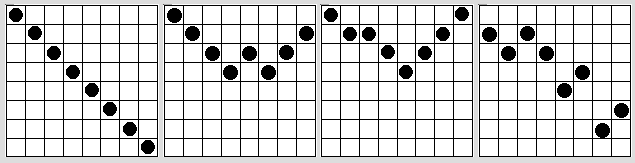

# 不甘心的皇后

## 题目描述

皇后是国际象棋里最厉害的角色（so are women in real world）。随着社会的不断发展，越来越多的人们意识到皇后在国际象棋里的地位应该降低，这样国际象棋才会更公平、更有意思。

### 传统规则 vs 新规则

- **传统规则**：皇后能在任意方向（横、竖、斜）上移动任意步数
- **新规则**：
  - 竖直方向：可以移动任意步数
  - 其他方向（水平和对角）：只能像国王一样移动一格

但皇后们并不罢休，即使被剥夺了某些权利，她们也要想办法联合起来，即每个皇后都能被同伴支援保护。

### 联合条件

在每个棋盘上，我们在每一列上放一个皇后。棋盘上所有的皇后都想要联合起来，也就是说：**每两个相邻列的皇后之间的行距离最多只能差一格**，这样才可以及时互相支援。



> 上图给出了四个例子，前三个是正确的，最后一个是错误的。

---

## 输入描述

本题包括多组测试数据。

每组数据的格式如下：
1. 第一行包含一个整数 `n`（1 ≤ n ≤ 10），代表一个 n×n 的棋盘
2. 接下来的一行包括 `n` 个整数，代表初始时每列已有的皇后的位置：
   - 如果值为 `i`，则代表在这一列上，由上向下数第 `i` 个格子已经放了皇后
   - 如果值为 `0`，代表这一列还没有皇后，这时你可以在满足题目要求的情况下把一个皇后放在这一列的任意位置
3. 当 `n=0` 时输入结束，这组数据不包括在需要计算的数据中

---

## 输出描述

对于每一组输入数据，输出一个整数，代表在这种情况下符合条件的放置皇后的方法种数。输出 `0` 代表无法满足条件。

---

## 样例

### 输入
```
8
0 0 0 0 0 0 0 0
4
1 2 0 3
4
1 2 3 4
4
1 3 2 4
0
```

### 输出
```
11814
2
1
0
```